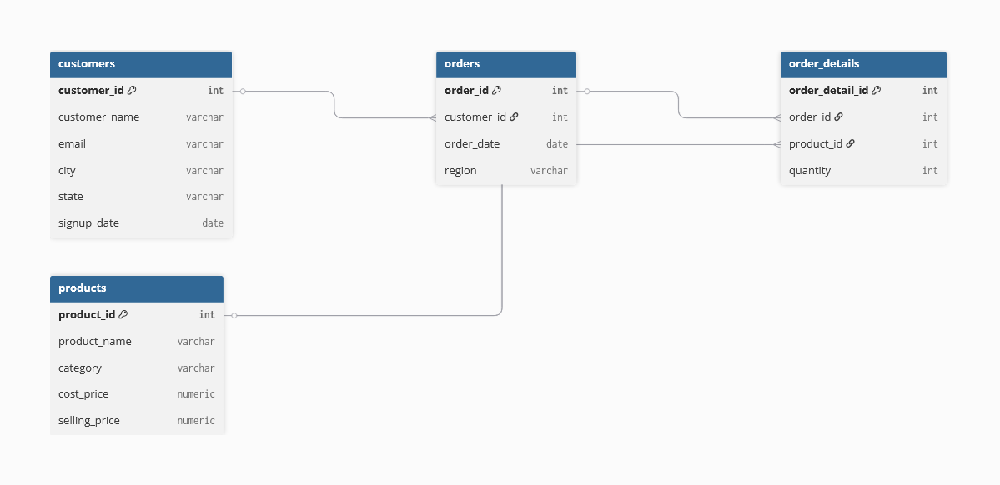
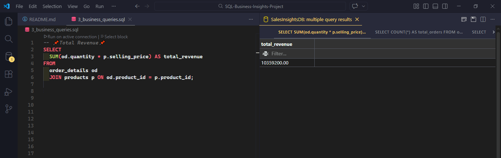
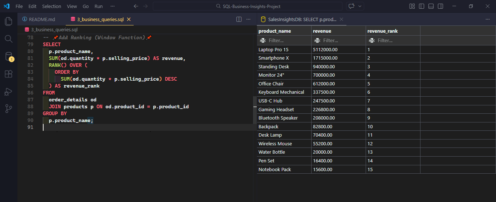
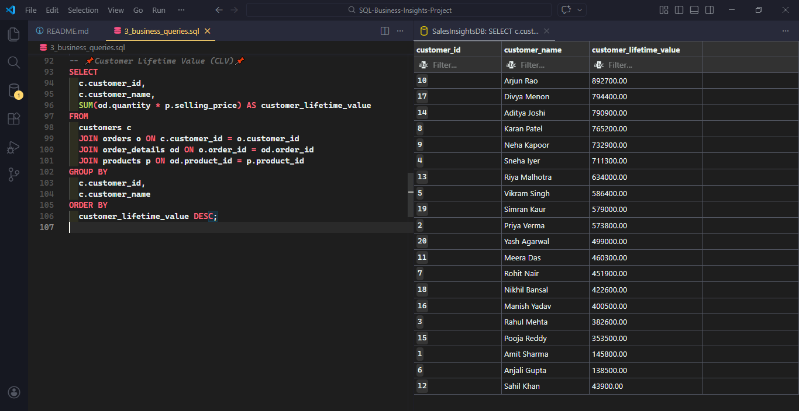
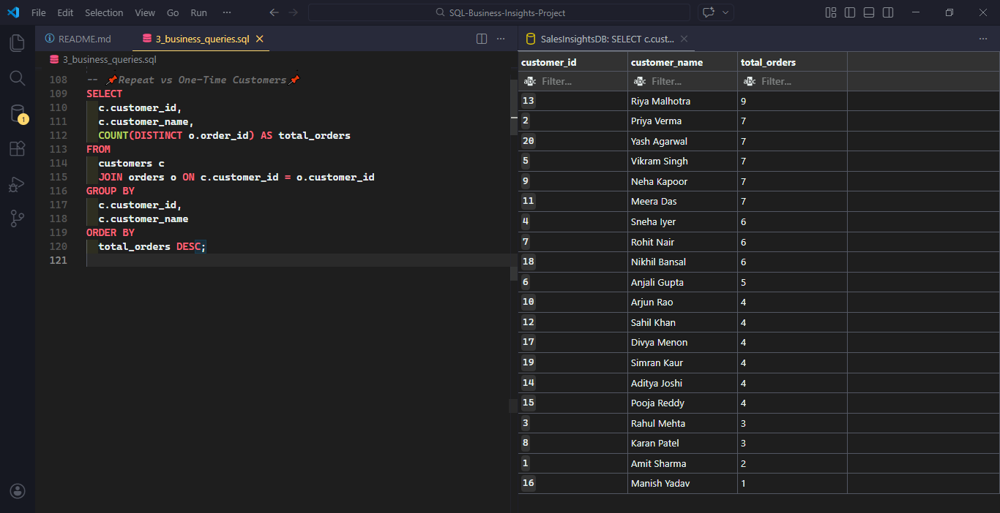
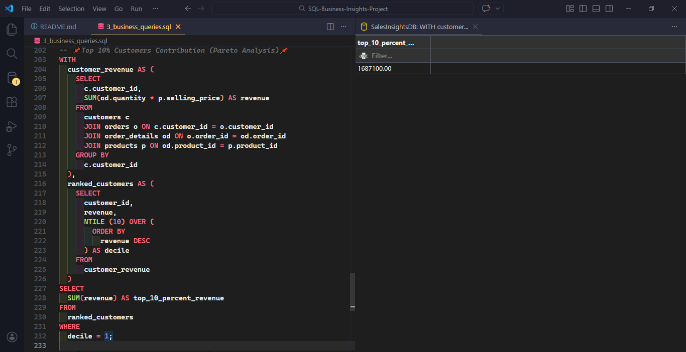

# 📊 SQL Business Insights Project – Sales Dataset

## 🔍 Project Overview

This project analyzes a structured sales dataset using PostgreSQL to uncover business insights related to revenue, profitability, customer behavior, and product performance.

The goal was to simulate a real-world relational database and perform advanced SQL analysis using joins, aggregations, CTEs, and window functions.

---

## 🗄️ Database Structure

The dataset follows a relational schema:

- **`customers`** – customer information
- **`products`** – product details including cost and selling price
- **`orders`** – order-level data
- **`order_details`** – transaction-level product quantities

The database was generated using SQL and includes:

- 20 customers
- 15 products
- 100 orders
- 300 order line items

---

## 📊 Entity Relationship Diagram (ERD)

Customers (1) —— (Many) Orders  
Orders (1) —— (Many) OrderDetails  
Products (1) —— (Many) OrderDetails



---

## 📎 Dataset Generation

The dataset was programmatically generated using PostgreSQL functions:

- Random customer assignment using `RANDOM()`
- Random date generation within 2024
- Random region selection using `ARRAY` indexing
- Multiple order line items generated using `generate_series()`

This approach simulates realistic business data while preserving relational integrity using foreign key constraints.

---

## 📈 Key Business Metrics Analyzed

### 💰 Revenue & Profit

- Total Revenue: **10,359,200**
- Total Profit: **3,388,000**
- Profit Margin: ~32.7%

---

### 🏆 Product Performance

- Top Revenue Product: **Laptop Pro 15**
- Revenue Contribution: ~49% of total revenue
- Product ranking implemented using:
  - `RANK()`
  - `DENSE_RANK()`

---

### 👤 Customer Analysis

- Top Customer (CLV): **Arjun Rao – 892,700**
- Repeat Customers: 19 out of 20
- Revenue from Repeat Customers: **96%**
- Profit from Repeat Customers: **~97%**

---

### 🛒 Average Order Value (AOV)

- AOV: **103,592**

Indicates high-ticket purchasing behavior driven by premium electronics.

---

### 📊 Pareto (Top 10% Customers)

- Top 10% customers contribute: **~16% of total revenue**
- Revenue distribution is diversified (low concentration risk)

---

## 📷 Sample Query Outputs

### 🔹 Total Revenue & Order Summary



### 🔹 Product Revenue Ranking (Window Function - RANK)



### 🔹 Customer Lifetime Value (CLV)



### 🔹 Revenue Contribution: Repeat vs One-Time Customers



### 🔹 Pareto Analysis – Top 10% Customers Contribution



---

## 🧠 SQL Concepts Used

- INNER JOIN (multi-table joins)
- GROUP BY & HAVING
- Aggregate functions (SUM, COUNT)
- CTEs (WITH clause)
- Window functions:
  - `RANK()`
  - `DENSE_RANK()`
  - `NTILE()`

- Date functions
- Revenue & margin calculations
- Customer segmentation logic

---

## 🎯 Business Insights

- Revenue and profit are heavily driven by repeat customers.
- Business model is retention-focused rather than acquisition-driven.
- Revenue is moderately diversified across customers.
- High-value products significantly impact total revenue.
- Strong opportunity exists to convert one-time buyers into repeat customers.

---

## 🛠️ Tools Used

- PostgreSQL
- VS Code (SQLTools Extension)

---

## 📌 Project Purpose

This project demonstrates practical SQL skills required for a Data Analyst role, including:

- Writing complex queries
- Interpreting business data
- Performing customer and product segmentation
- Applying analytical thinking beyond basic `SELECT` statements

---

## 📁 Project Structure

```
SQL-Business-Insights-Project/
│
├── 1_database_setup.sql
├── 2_data_inserts.sql
├── 3_business_queries.sql
├── README.md
└── screenshots/
    ├── total_revenue.png
    ├── product_ranking.png
    ├── customer_clv.png
    ├── repeat_vs_onetime_revenue.png
    ├── pareto_top_10_percent.png
    └── erd.png

```

---

## 🚀 Next Steps

Future enhancements may include:

- Cumulative revenue analysis
- Cohort analysis
- Time-series profit trends
- Integration with dashboard visualization tools

---

## 🚀 Author

Amit Kumar  
Aspiring Data Analyst
